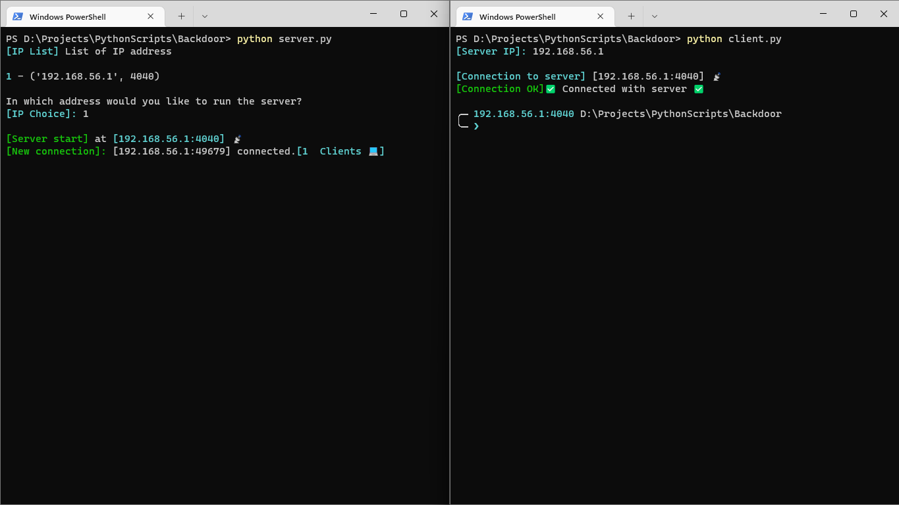

# backdoor

Backdoor project with python and sockets

## Python Requirements

- termcolor
- tqdm
- pillow

## Initialization

1. run **server.py** on the target machine (on the same local network or the same machine where **client.py** is running)
2. run **client.py**
3. Enter the IP address of the server (the target)
4. Press Enter (Server and client have been connected)
5. You can send **shell commands** and receive outputs from the server

## Specials commands

- ⌨️ **download** <filename (required)> <destination (required)>
- ⌨️ **capture** <destination (required)>
- ⌨️ **os**
- ⌨️ **clients**
- ⌨️ **local** <command (required)>
- ⌨️ **exit**
